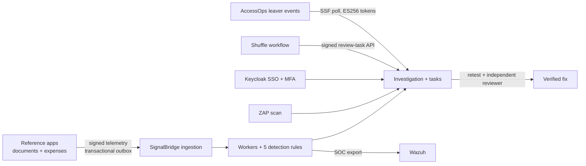

# SignalBridge

**Catch the access that should have ended.** SignalBridge is a detection lab. Two test apps send signed events about who tried to read what; five detection rules flag access that continues after a permission was removed, and an analyst takes each finding to a fix that someone else verifies. I ran it against real Keycloak, Wazuh, OWASP ZAP and Shuffle in an isolated lab.

[Case study](https://aman-agarwal6.github.io/projects/signalbridge.html) · [Evidence guide](docs/EVIDENCE.md) · [Lessons learned](docs/LESSONS.md) · [Releases](https://github.com/aman-agarwal6/signalbridge/releases)



## What testing found

| Problem | Before the fix | Now |
| --- | --- | --- |
| Write race | A user just removed from a workspace could still make 4 case writes | Permissions re-checked inside the database transaction; 13 regression tests |
| Sign-in blocked | A keyboard-only browser test showed the console's Content-Security-Policy blocked the redirect to Keycloak | Policy fixed, with its own regression test |
| Generated Splunk query | pySigma's Splunk output for R5 compiled, but Splunk refused to run it | Hand-written SPL with rolling windows; generated and hand-written queries labeled |
| Default lab password | Scanner triage flagged a default database password and open backend ports | All 8 database credentials rotated, ports closed, memory and CPU capped |
| Wazuh log limit | The collector stopped at 10.6 hours of a planned 24-hour run | Log-folder limit fixed |

[Lessons learned](docs/LESSONS.md) covers each of these and the other failures the lab runs uncovered.

## Results

October 1–5, 2026, with synthetic data. The runs used real components (PostgreSQL, Keycloak, Wazuh, ZAP, Prometheus and Grafana, Chromium) in an isolated lab; the detection evaluation runs in memory. Each row links the record its run wrote.

| Area | Result | Record |
| --- | --- | --- |
| Access assurance | 23 source events processed; a planted authorization bug let a removed member read a private document, and rule R3 opened one investigation | [b8667b81](docs/evidence/20261002-reference-access-b8667b816ce8419da7f3d5d9ac9d6ad6.json) |
| Sign-in and MFA | Keycloak password and TOTP: 28 protocol checks (replay, CSRF, app scoping, key rotation, back-channel logout, session expiry) and 5 keyboard-only Chromium checks | [73632025](docs/evidence/20261004-identity-native-73632025aeee400bb7ee49b69fba7c99.json) |
| Wazuh | 24 records archived and 8 alerts, each raised once; a recovery run survived a collector stop and log rotation with no extra copies | [0d137b47](docs/evidence/20261003-wazuh-native-collection-0d137b4720ad476faa68d36754b7357f.json), [4a5748dc](docs/evidence/20261003-wazuh-native-recovery-4a5748dcc7a74525a7469dc8d802438a.json) |
| ZAP | One finding on the faulty build, none after the fix; the console imported it on the right app only | [d975b97f](docs/evidence/20261003-authenticated-zap-offline-d975b97fad814c9b8e4304e114c776e5.json), [6bce0948](docs/evidence/20261003-console-restoration-6bce09482a3b430aadb98b589d40f04e.json) |
| Finding to fix | On a restored console: assigned, fix task, retest imported, self-review refused, independent reviewer approved | [de4f6409](docs/evidence/20261003-console-restoration-de4f6409fdf444a9bc22cf60463cdb05.json) |
| PostgreSQL | 14 concurrency and crash-recovery checks, including sign-in and reviewer races and a killed worker | [ed3829e7](docs/evidence/20261001-postgresql-in-network-ed3829e7b3dd45379d0c0290e324df85.json) |
| Monitoring | Prometheus and Grafana: backlog alerts fired and cleared; 24 checks passed | [0cd4256f](docs/evidence/20261003-monitoring-native-0cd4256f4a1c4f2692f67eae4704bd53.json) |
| Endurance | A compressed 40-minute run recovered from all five planned interruptions with every event delivered and seen by Wazuh. A continuous run delivered all 27,118 reads over 13.5 hours | [rehearsal](docs/evidence/20261004-reliability-rehearsal-8a1889fec8ef49f5acde3c01bfa88e63-remeasured.json), [continuous](docs/evidence/20261004-reliability-continuous-894fb388a2004b43b6b1643e93342df4-summary.json) |
| Shuffle | A Shuffle workflow in a VM with no network adapter ran nine scenarios against the signed review-task API: retries returned the original task; replayed, changed, wrong-app and stale requests were refused; a lost reply was recovered | [315cfb85](docs/evidence/20261005-shuffle-native-workflow-315cfb85-9c28-4e4e-9cac-8ce455e92448.json) |
| Leaver signals | Polled [AccessOps](https://github.com/aman-agarwal6/AccessOps)' signed Shared Signals events: 38 tokens across two live rounds verified (ES256), stored once, then acknowledged. In round two, a contained test account was re-enabled and used, and SignalBridge opened a critical "access after departure" case | [dry run](docs/evidence/20261005-accessops-leaver-dry-run-f567427abbbc4929ad50e25be2c84724.json), [round 1](docs/evidence/20261005-accessops-leaver-poll-eefe76ecded04ffe9892bd174c973232.json), [round 2](docs/evidence/20261005-accessops-leaver-poll-931402fb1ee44209b58c60063f63150f.json) |
| Accessibility | axe-core 4.13 on 19 console and portfolio pages in light and dark mode: 0 violations after fixing six issue types | [axe scan](docs/evidence/20261005-accessibility-axe-scan.json) |
| Detection | 48 scenarios: precision 15/21, recall 15/23, false-positive rate 6/18, 7 inconclusive | [evaluation](docs/evidence/20261005-enterprise-detection-evaluation-public-release.json) |
| Detection as code | R1–R5 rewritten as [Sigma rules](detections/README.md) with ATT&CK tags, plus SPL and KQL, each run on the same 48 scenarios. KQL in Microsoft's Kusto emulator matched the Python rules in 48; hand-written SPL in Splunk Free in 45 (events exactly on a window edge); compiled Sigma in 45 (re-grants it can't express) | [Splunk](detections/engines/splunk-run.json), [Kusto](detections/engines/kusto-run.json), [Sigma replay](detections/sigma/replay-report.json) |


## See it

| If you want to | Open |
| --- | --- |
| See each tool run with its record | [Evidence viewer](https://aman-agarwal6.github.io/signalbridge/portfolio/) |
| Watch the finding unfold | [Recorded access walkthrough](portfolio/access-assurance.html) |
| Review the implementation | [Engineering reference](docs/DESIGN.md): code map, security boundaries, rules and verification |
| Check the security design | [Threat model](docs/THREAT_MODEL.md): trust boundaries, threats, controls and the test or run that checks each |
| Download a fixed version | [Releases](https://github.com/aman-agarwal6/signalbridge/releases): source archive, SBOM and Sigstore provenance, built only after CI passes on that commit |

## Run the lightweight console

Requires Python 3.11+ and Node 24+. This local SQLite demo needs no Docker. From the repository root:

```powershell
python -m venv .venv
.venv\Scripts\python.exe -m pip install -r requirements-dev.txt
.venv\Scripts\python.exe -B scripts/sb.py doctor
.venv\Scripts\python.exe -B scripts/sb.py demo-core
```

`demo-core` starts the console at http://127.0.0.1:8741/ with clearly labeled synthetic fixtures; random local credentials are written to the ignored `var/local-access.txt` (keep it private). `scripts/sb.py up` reopens it and `scripts/sb.py down` stops it without losing data. On Linux/macOS use `.venv/bin/python`. The native lab stages need Docker and their own launchers; see the [engineering reference](docs/DESIGN.md#verification-and-operation).

## Limits

- Synthetic data in an isolated lab on one PC; not a production deployment.
- I wrote the 48 evaluation scenarios knowing the rules, so the scores catch regressions rather than measure real-world accuracy.
- The planned 24-hour run stopped at 10.6 hours of Wazuh capture, and I didn't repeat it.
- The console trusts local administrators and must not be exposed publicly. See [SECURITY.md](SECURITY.md).

By [Aman Agarwal](https://aman-agarwal6.github.io/). MIT licensed.
