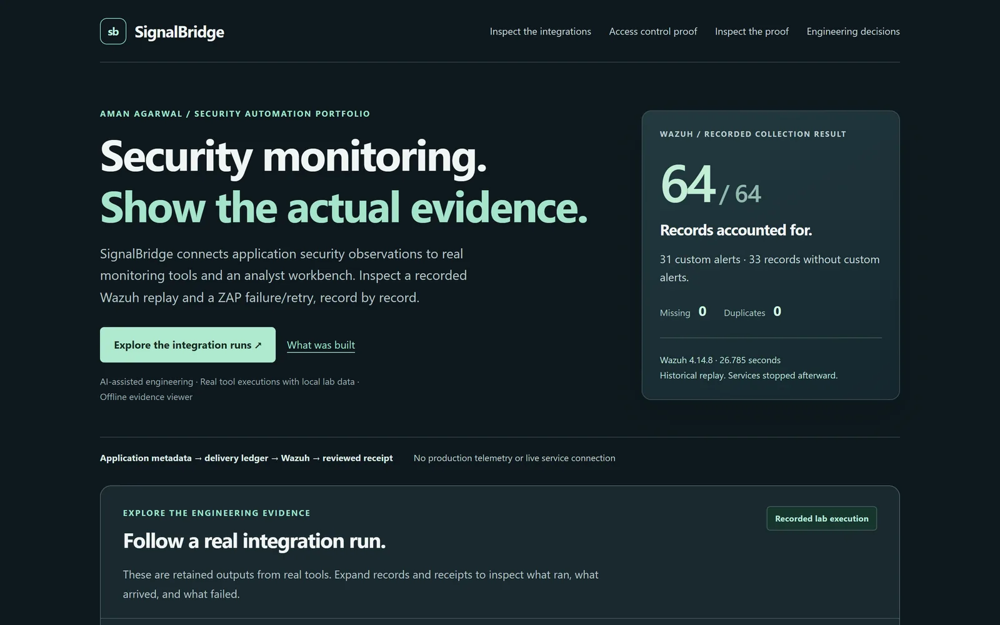
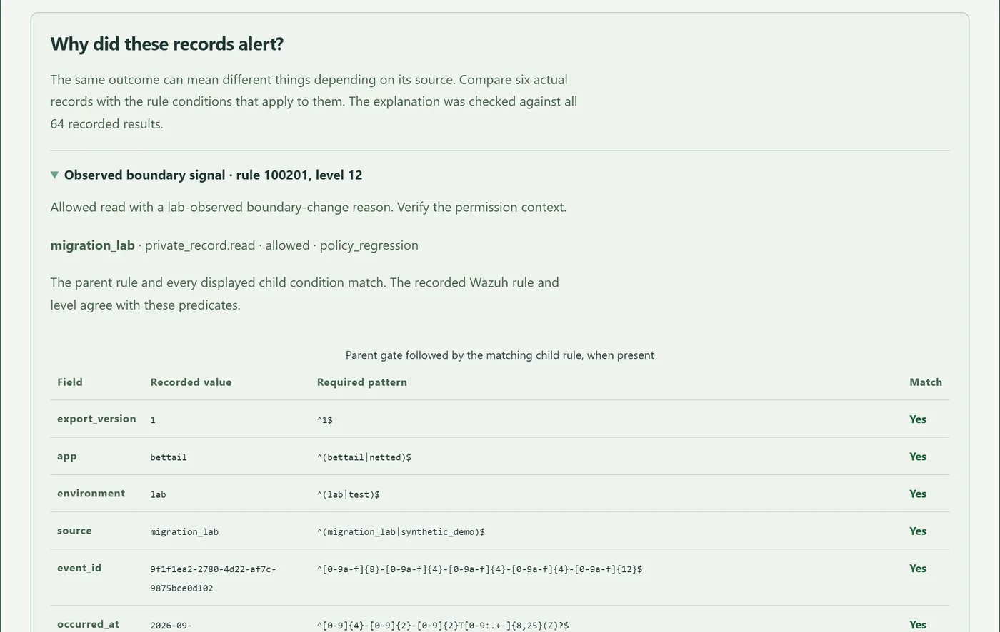

# SignalBridge

SignalBridge is a security workbench for access-control monitoring. It collects signed telemetry from web applications, runs detection rules over it, and gives an analyst a console to investigate cases, review scanner findings and record decisions. I built it to monitor my own apps (BetTail and Netted) and connected it to Wazuh and OWASP ZAP in isolated Docker labs.

[Evidence viewer](https://aman-agarwal6.github.io/signalbridge/portfolio/) · [Design notes](docs/DESIGN.md) · [Case study](https://aman-agarwal6.github.io/projects/signalbridge.html)

[Current enterprise handoff (PDF)](output/pdf/SignalBridge_Enterprise_Handoff.pdf) groups the architecture, current checks, native results and failures, detection limits, unfinished gates and interview learning steps. The enterprise milestone is in progress. The September [personal handoff](output/pdf/SignalBridge_Recruiter_Handoff.pdf) remains historical; its results were not silently reassigned to new source.

**Current enterprise evidence:** nine genuine PostgreSQL concurrency/recovery checks passed. A [new frozen 48-scenario evaluation](docs/evidence/20261001-enterprise-detection-evaluation-format2.json) retained 15 true positives, 6 false positives, 8 misses, 12 true negatives and 7 inconclusives. Precision is 15/21, recall 15/23 and false-positive rate 6/18. This builder-selected set is not an independent or production benchmark. A formatting-only source correction required a fresh identity and repeat of the same scenarios; both receipts remain, without counting the repeat as more accuracy evidence. The [September evaluation and five AI reference reviews](portfolio/evaluation.html) remain historical.



## What's in it

- **Signed ingestion.** HMAC-SHA-256 request signing, a closed JSON schema capped at 16 KiB, replay and duplicate handling, and per-app rate limits. The schema has no fields for personal data.
- **Five versioned rules.** R1 flags one account failing to read three or more distinct private records within five minutes. R2 uses source-labeled revocation/regression reads. R3 correlates effective resource-scoped permission removal with later allowed access. R4 covers five distinct denied resources within 30 minutes spanning at least ten minutes. R5 covers six denied reads of one resource by at least three accounts within ten minutes. None establishes attacker intent.
- **Analyst console.** Cases scoped per app, viewer/analyst/reviewer roles, CSRF protection, a no-script CSP, strict session cookies and login throttling. Reviewers can't approve their own rule changes.
- **Enterprise workflow in development.** App-scoped assignment, acknowledgement, deadlines, categorized notes and evidence-bound tasks. Queues expose assigned, unassigned, unacknowledged and overdue work. Separate machine credentials can read evidence or create one review task; signed requests, replay limits, version checks and transactional idempotency constrain these interfaces. A task or resolved case is not a verified fix.
- **Wazuh integration.** A recorded backfill delivered 64 of 64 events with the 31 expected alerts and no loss or duplicates. A separate run restarted the collector twice without losing input.
- **ZAP integration.** Passive scan imports. A scan against an unavailable target is recorded as failed, not clean.
- **Current local checks.** The retained October round passed 1,177 Python and 62 distinct Node methods, plus configuration, migration, lint/format and publication checks. Nine native PostgreSQL methods passed separately. These counts are regression evidence, not detection accuracy or enterprise coverage. September's 1,102-test verification remains historical.

The historical challenge remains attached to its original source and inputs. New R4/R5 provide bounded slow and same-resource distributed coverage; missing affected-member context and activity outside their thresholds remain gaps. R3 requires authoritative v2 telemetry and does not invent missing context. Native enterprise source execution remains unfinished. See the [design notes](docs/DESIGN.md#detection-rules).

## Why a record alerted

The evidence viewer shows each alert field by field against the Wazuh rule that fired.



## Running it

The **Enterprise Assurance Milestone is in progress** in this checkout. Its
PostgreSQL queue and isolated reference applications have portable regression
coverage; enterprise SSO, native source telemetry, expanded integrations and the
24-hour run are still acceptance gates. Historical September receipts describe
their recorded revision. A new frozen enterprise evaluation has executed; the
September evaluator deliberately rejects the changed source.

Requires Python 3.11+. Node 24+ is needed for the courier and its tests. On Windows:

```powershell
python -m venv .venv
.venv\Scripts\python.exe -m pip install -r requirements-dev.txt
.venv\Scripts\python.exe -B scripts/sb.py doctor
.venv\Scripts\python.exe -B scripts/sb.py demo-core
```

Then open http://127.0.0.1:8741/. `demo-core` creates local accounts with random passwords in `var/local-access.txt`, which git ignores. On Linux or macOS, use `.venv/bin/python`.

Tests:

```powershell
.venv\Scripts\python.exe manage.py test tests --exclude-tag offline_simulation --exclude-tag native_postgres
$env:SB_SECRET_KEY = "any-long-random-test-value"
.venv\Scripts\python.exe manage.py test tests --tag offline_simulation --settings config.simulation_settings
.venv\Scripts\python.exe manage.py test reference_lab --settings config.reference_verification_settings
node --test integrations/sender.test.mjs integrations/supabase-http.test.mjs integrations/bettail-routes.test.mjs
```

On Windows, prefer a short checkout path such as `C:\src\signalbridge`. Snapshot test fixtures now use shorter paths; actual application snapshots can still be deeply nested.

Lightweight SQLite use does not require Docker. Native PostgreSQL and selected
security-tool executions are mandatory for the unfinished enterprise milestone.
The [native PostgreSQL receipt](docs/evidence/20261001-postgresql-in-network-1d8fd148036e43b0915fbbe86606d013.json)
records nine passed methods: concurrent ingestion, duplicate/conflict handling,
two workers, case/task concurrency and actual killed-process recovery. Two
512 MiB containers used an internal network with no exposed ports. Cached wheels
installed only in container temporary storage. Main and independent shutdown
passed; Docker Desktop was stopped. Earlier failures remain in separate receipts.
This component proof is plaintext, not enterprise TLS/source/identity/soak proof.
No new launch approval is implied by `integrations/enterprise/in-network-stage-plan.json`.
The reference collector has durable leases, acknowledgement checks and a fixed
TLS loopback destination; its current tests use transport doubles, not a native
TLS service. New lab launches and dependencies need their prepared operator review.

The retained September evaluation is readable in `portfolio/evaluation.html`.
Reproduction requires its matching historical source revision. On the changed
enterprise checkout, its old command fails closed. Use the separate current round:

```powershell
.venv\Scripts\python.exe -B scripts/evaluate_enterprise_detection.py
```

Open `portfolio/evaluation.html` for September's retained results, five AI-authored teaching reviews and a 30-minute personal exercise. Current reruns write receipts under `artifacts/local/enterprise-detection-evaluation/`. Do not replace existing freezes or declarations; changes to frozen implementation require a new identity. CI runs push/PR checks and a separate disposable PostgreSQL job. The first published run exposed historical challenge scoping and checkout ownership failures; both are retained while the corrected profile is verified. The courier already imports its eight persistence tests; avoid counting them twice.

The historical v1 challenge scores only its original R1/R2 contracts. Its shared resource pseudonyms allow newer multi-account correlation across scenarios; those findings remain in the database but are excluded from the old score. R3–R5 coverage is measured separately in the frozen 48-scenario round, with its false alerts and misses preserved.

## Layout

| Path | Contents |
| --- | --- |
| `bridge/` | Django app: ingestion, detection engine, worker, rule replay, scanner imports, console |
| `reference_lab/` | Isolated synthetic document/expense authorization and transactional telemetry |
| `integrations/` | Delivery courier, Wazuh rules and backfill, ZAP import, BetTail route harness |
| `tests/` | Python and Node tests |
| `docs/evidence/` | JSON receipts for every recorded run |
| `portfolio/` | The evidence viewer (static HTML, no scripts) |
| `scripts/` | Setup, verification and lab runners |

## Notes

This is a local proof of concept, not a hosted service. The console trusts local administrators and shouldn't be exposed to a network. See [SECURITY.md](SECURITY.md).

Built by [Aman Agarwal](https://aman-agarwal6.github.io/) in September 2026, with AI coding agents writing much of the code under my direction. I developed it in a private repository; this is a cleaned public snapshot, so its history starts here. MIT licensed.
