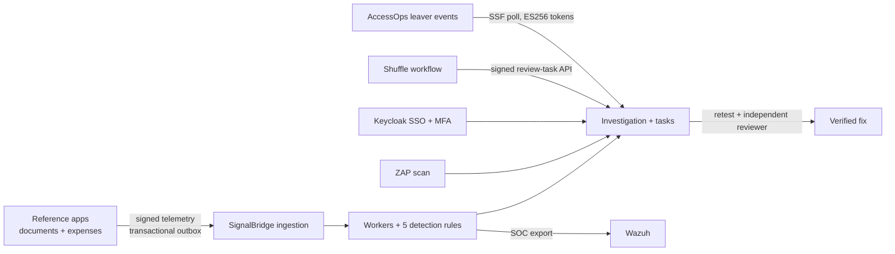
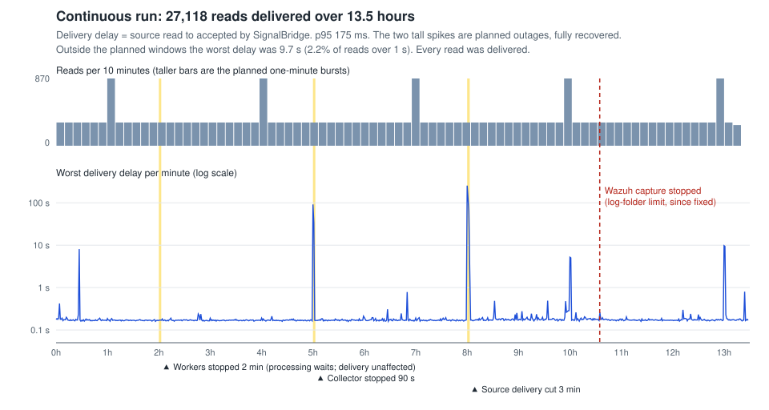

# SignalBridge

**Connect a permission change to what an account can actually read.** SignalBridge is an application access-assurance lab: it watches real authorization paths in two synthetic business apps, detects when someone keeps access they should have lost, and drives an analyst from finding to an independently verified fix.



## What was proven

Each result links the receipt its run recorded. The runs used real components (PostgreSQL, Keycloak, Wazuh, ZAP, Prometheus/Grafana, Chromium) in an isolated lab; the detection evaluation runs in memory.

| Area | Result | Receipt |
| --- | --- | --- |
| Access assurance | 23/23 source events processed; a deliberately injected authorization defect let a removed member read a private document, and rule R3 opened one investigation | [b8667b81](docs/evidence/20261002-reference-access-b8667b816ce8419da7f3d5d9ac9d6ad6.json) |
| Login and MFA | Keycloak password + TOTP: 28 protocol controls (replay, CSRF, app scoping, key rotation, back-channel logout, session expiry) and 5 real-Chromium keyboard-walkthrough controls; the browser found a real CSP bug, since fixed | [73632025](docs/evidence/20261004-identity-native-73632025aeee400bb7ee49b69fba7c99.json) |
| Wazuh | 24/24 records archived and 8/8 alerts raised exactly once; recovery run survived a collector stop and log rotation with zero extra copies | [0d137b47](docs/evidence/20261003-wazuh-native-collection-0d137b4720ad476faa68d36754b7357f.json), [4a5748dc](docs/evidence/20261003-wazuh-native-recovery-4a5748dcc7a74525a7469dc8d802438a.json) |
| ZAP | Exactly one finding on the faulty build, none after the fix; the console imported it on the right app only | [d975b97f](docs/evidence/20261003-authenticated-zap-offline-d975b97fad814c9b8e4304e114c776e5.json), [6bce0948](docs/evidence/20261003-console-restoration-6bce09482a3b430aadb98b589d40f04e.json) |
| Investigation to fix | On a restored console: assign, remediation task, retest import, self-review refused, independent reviewer approved | [de4f6409](docs/evidence/20261003-console-restoration-de4f6409fdf444a9bc22cf60463cdb05.json) |
| PostgreSQL | 14/14 concurrency and crash-recovery checks, including identity and reviewer races | [ed3829e7](docs/evidence/20261001-postgresql-in-network-ed3829e7b3dd45379d0c0290e324df85.json) |
| Monitoring | Prometheus/Grafana 24/24 controls | [0cd4256f](docs/evidence/20261003-monitoring-native-0cd4256f4a1c4f2692f67eae4704bd53.json) |
| Restoration | Backup, restore into a separate database, migrate and run real operator workflows | [de4f6409](docs/evidence/20261003-console-restoration-de4f6409fdf444a9bc22cf60463cdb05.json), [6bce0948](docs/evidence/20261003-console-restoration-6bce09482a3b430aadb98b589d40f04e.json) |
| Endurance | All five interruptions in a compressed 40-minute run: every event delivered and seen by Wazuh, zero anomalies. A continuous run delivered all 27,118 reads over 13.5 hours, with Wazuh capturing the first 10.6 | [rehearsal](docs/evidence/20261004-reliability-rehearsal-8a1889fec8ef49f5acde3c01bfa88e63-remeasured.json), [continuous](docs/evidence/20261004-reliability-continuous-894fb388a2004b43b6b1643e93342df4-summary.json) |
| Shuffle | A real Shuffle workflow ran nine scenarios in an isolated, network-less VM against SignalBridge's signed review-task API: one task created, retries returned the original receipt, replay, changed content, another app's case and stale evidence were refused, and a lost reply was recovered | [315cfb85](docs/evidence/20261005-shuffle-native-workflow-315cfb85-9c28-4e4e-9cac-8ce455e92448.json) |
| Leaver signals | Polled [AccessOps](https://github.com/aman-agarwal6/AccessOps)' signed Shared Signals leaver events from its running lab: 38 tokens across two live rounds verified (ES256), stored once, then acknowledged. The genuine detection: an account re-enabled after containment and signed in to opened a critical "access after departure" case. Three first-round cases were test-induced (AccessOps' test backdated departures by 5 seconds) | [dry run](docs/evidence/20261005-accessops-leaver-dry-run-f567427abbbc4929ad50e25be2c84724.json), [poll](docs/evidence/20261005-accessops-leaver-poll-eefe76ecded04ffe9892bd174c973232.json), [round 2](docs/evidence/20261005-accessops-leaver-poll-931402fb1ee44209b58c60063f63150f.json) |
| Accessibility | axe-core 4.13 (WCAG 2.0-2.2 A/AA plus best practice) on 19 console and portfolio pages in light and dark mode: 0 violations after fixing six issue types, including an almost invisible link and a chart that hid its links from screen readers | [axe scan](docs/evidence/20261005-accessibility-axe-scan.json) |
| Detection | 48 builder-selected scenarios: precision 15/21, recall 15/23, false-positive rate 6/18, 7 inconclusive | [evaluation](docs/evidence/20261005-enterprise-detection-evaluation-public-release.json) |
| Detection as code | R1–R5 rewritten as [Sigma rules](detections/README.md) with ATT&CK tags, plus Splunk SPL and KQL, each run on the same 48 scenarios. KQL in Microsoft's Kusto emulator matched the Python rules in 48; hand-written SPL in Splunk Free in 45 (events exactly on a window edge); compiled Sigma in 45 (re-grants it cannot express). Splunk rejected pySigma's generated R5 query | [Splunk](detections/engines/splunk-run.json), [Kusto](detections/engines/kusto-run.json), [Sigma replay](detections/sigma/replay-report.json) |

The [evidence guide](docs/EVIDENCE.md) explains each run in plain language, and [lessons learned](docs/LESSONS.md) covers the real failures these runs uncovered and how each was fixed.



## See it

| If you want to | Open |
| --- | --- |
| See each tool run with its receipt | [Evidence viewer](https://aman-agarwal6.github.io/signalbridge/portfolio/) |
| Watch the finding unfold | [Recorded access walkthrough](portfolio/access-assurance.html) |
| Review the implementation | [Engineering reference](docs/DESIGN.md): code map, security boundaries, rules and verification |
| Check the security design | [Threat model](docs/THREAT_MODEL.md): trust boundaries, threats, controls and the test or run that checks each |

## Run the lightweight console

Requires Python 3.11+ and Node 24+. This local SQLite demo needs no Docker. From the repository root:

```powershell
python -m venv .venv
.venv\Scripts\python.exe -m pip install -r requirements-dev.txt
.venv\Scripts\python.exe -B scripts/sb.py doctor
.venv\Scripts\python.exe -B scripts/sb.py demo-core
```

`demo-core` starts the console at http://127.0.0.1:8741/ with clearly labeled synthetic fixtures; random local credentials are written to the ignored `var/local-access.txt` (keep it private). `scripts/sb.py up` reopens it and `scripts/sb.py down` stops it without losing data. On Linux/macOS use `.venv/bin/python`. The native lab stages need Docker and their own reviewed launchers; see the [engineering reference](docs/DESIGN.md#verification-and-operation).

## Honest limits

- Synthetic data in an isolated lab on one PC; not a production deployment, high-availability system or enterprise-tool replacement.
- The full 24-hour run was not completed: the first attempt's Wazuh collector stopped at 10.6 hours on a log-folder limit (fixed), and the owner chose not to repeat the day.
- The copied BetTail adapter is implemented and offline-checked; its native run was deliberately not pursued.
- Detection numbers come from builder-selected scenarios: regression evidence, not independent accuracy.
- The console trusts local administrators and must not be exposed publicly. See [SECURITY.md](SECURITY.md).

Built under [Aman Agarwal's](https://aman-agarwal6.github.io/) project direction, with AI coding agents writing much of the implementation. Personal analyst judgments and independent review are separate deliverables. MIT licensed.
