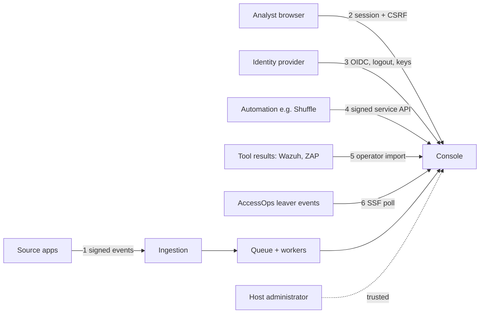

# Threat model

What SignalBridge defends against, where each control lives and how it was checked. The scope is the console, its ingestion and workers, and the lab integrations, run on one machine. Production deployment is out of scope; see [Accepted risks](#accepted-risks).

## What is worth protecting

- **Evidence integrity.** A case must reflect what the source app actually did. A forged, replayed or altered event could open a false case or hide a real one.
- **Decision integrity.** A fix counts as verified only after a matching retest and an independent reviewer. Nobody may approve their own work.
- **Case confidentiality.** Cases hold pseudonymous actors and resources, analyst notes and, in printed briefs, account names. Each app's cases are visible only to that app's members.
- **Credentials.** Per-app signing keys, the two service-API keys, the identity provider's client secret and session cookies.
- **Processing availability.** One noisy or hostile source must not stall the others.

## Trust boundaries

## Threats and controls

### 1. Source apps → ingestion

| Threat | Control | Checked by |
| --- | --- | --- |
| Forged event from someone without the app's key | HMAC-SHA-256 over version, app, key ID, timestamp and exact body; constant-time compare | `test_bad_signature_expired_time_and_body_tampering_fail_closed` |
| One app's key used to post as another app | Provenance comes from the signing key, never the body | `test_app_body_cannot_override_key_scope` |
| Replay of a captured request | Five-minute timestamp window, plus idempotency on event ID: identical content is a duplicate, changed content is HTTP 409 | `test_changed_duplicate_is_conflict`; access run [b8667b81](evidence/20261002-reference-access-b8667b816ce8419da7f3d5d9ac9d6ad6.json) |
| Malformed or oversized input | Closed JSON schemas up to 16 KiB; duplicate keys, non-finite numbers and unknown fields rejected | `test_duplicate_json_keys_rejected`, `test_nonfinite_json_rejected`, `test_oversize_body_rejected`, `test_raw_identifiers_rejected` in `tests/test_security.py` |
| A source claims membership changes it does not own | Server-side `can_assert_membership` capability, off by default and rechecked inside the transaction | `test_capability_is_rechecked_under_transaction_lock` |
| A flood from one source | 600 new events per minute per app (HTTP 429), per-app queue serialization and capped detection queries | Enforced in `bridge/ingestion.py`; queue fairness in `test_locked_application_is_skipped_while_another_application_progresses` (native PostgreSQL) |

### 2. Analyst browser → console

| Threat | Control | Checked by |
| --- | --- | --- |
| An analyst reads or changes another app's cases | App membership checked on every list, object, export and write; superusers get no bypass | `test_application_scope_applies_to_every_read_and_write`; three cross-app write controls in identity run [73632025](evidence/20261004-identity-native-73632025aeee400bb7ee49b69fba7c99.json) |
| Access removed during a session | Sensitive writes recheck permission inside the transaction | `test_account_disabled_after_scope_check_cannot_write`; `permission_withdrawal_immediate` (native) |
| Approving one's own fix | Independent current reviewer required, also enforced by a database constraint | `test_database_constraint_rejects_unreviewed_approval_or_self_review`; self-review refused in restoration run [de4f6409](evidence/20261003-console-restoration-de4f6409fdf444a9bc22cf60463cdb05.json) |
| Cross-site request forgery | Django CSRF on every browser write | `test_browser_operation_requires_csrf_even_with_session`; `csrf_missing_write_denied` (native) |
| Script injection through notes or evidence | Output escaping; a CSP that blocks inline scripts, external connections and framing | `test_analyst_note_is_escaped_and_audited`; real-browser `browser_csp_blocks_inline_script` and `browser_framing_blocked` |
| Password guessing | Throttle after eight failures per address or username in 15 minutes; Keycloak's own rate limit when federated | `wrong_password_rejected`, `wrong_totp_rejected` (native) |
| Stolen or stale session | HttpOnly, SameSite and Secure cookies; one-hour local sessions; federated admission of at most 15 minutes; sessions stored as keyed digests | `browser_cookie_attributes_enforced`, `real_session_expiry_denied` (native) |

### 3. Identity provider → console

| Threat | Control | Checked by |
| --- | --- | --- |
| Stolen or injected authorization code | Authorization-code flow with S256 PKCE, nonce, and single-use state bound to the browser and issuer | `callback_replay_rejected`, `callback_wrong_state_rejected` (native) |
| Token from the wrong issuer or audience | Signature, issuer, audience and expiry checks; an exact issuer and subject map to a pre-provisioned account. No email matching and no automatic sign-up | `unmapped_local_admission_denied` (native) |
| Forged sign-out | Signed back-channel logout tokens bound to issuer, subject and session, with a replay digest | `malformed_logout_token_rejected`, `native_backchannel_logout_revoked_session` (native) |
| Key-rotation spoofing | Keys refreshed only from the fixed provider endpoint, rate-limited and fail-closed | `provider_signing_key_rotation_admitted` (native) |
| Sign-in redirect blocked or redirected elsewhere | `form-action` allows exactly the one configured provider origin | `test_form_action_allows_only_the_fixed_provider_when_federated`; found by the real-browser run |

### 4. Automation → service API

| Threat | Control | Checked by |
| --- | --- | --- |
| Automation does more than it should | Two separate capabilities, each with its own key: read bounded case evidence, or create one review task. Neither can close cases, approve fixes, change source accounts or send messages | `tests/test_shuffle_lab.py`; the Shuffle receiver checks; native [Shuffle run 315cfb85](evidence/20261005-shuffle-native-workflow-315cfb85-9c28-4e4e-9cac-8ce455e92448.json): another app's case refused (404) |
| Replayed or re-signed automation request | HMAC over key ID, nonce, time, method, path and body hash; nonce reuse rejected even for an idempotent body | `test_nonce_replay_is_rejected_even_for_idempotent_body`; native [Shuffle run 315cfb85](evidence/20261005-shuffle-native-workflow-315cfb85-9c28-4e4e-9cac-8ce455e92448.json): replay 409 `request_replayed` |
| Retries creating duplicate tasks | Transactional idempotency keys | `test_concurrent_duplicate_review_requests_create_one_logical_task` (native PostgreSQL); native [Shuffle run 315cfb85](evidence/20261005-shuffle-native-workflow-315cfb85-9c28-4e4e-9cac-8ce455e92448.json): retries and a lost reply returned the original task |
| Shuffle's Docker-socket access reaching other projects | Shuffle runs only in a dedicated VirtualBox guest with no network adapter and no shared folders | `assert_isolated` in `integrations/shuffle/lab/host_controller.py`, checked before and after every run |

### 5. Tool results → console

| Threat | Control | Checked by |
| --- | --- | --- |
| A tampered or misattributed scan or SOC result | Imports pinned by hash, closed tool profiles, and findings bound to exact source events and app scope | ZAP import on the right app only ([6bce0948](evidence/20261003-console-restoration-6bce09482a3b430aadb98b589d40f04e.json)); `test_conflicting_or_invalid_sarif_rule_index_fails_instead_of_misattribution` |

### 6. AccessOps leaver events → receiver

| Threat | Control | Checked by |
| --- | --- | --- |
| A forged or altered leaver event | ES256 only, against a published P-256 key whose kid is its RFC 7638 thumbprint; no other algorithm path exists | `integrations/ssf/signature_tests.py` (real keys); live dry run verified 32 of 32 |
| A token that brings its own key, or a spoofed key URL | Header limited to typ, alg and kid (jku, jwk, x5u and crit refused); key URL fixed and checked against the transmitter metadata | `test_refused_tokens_are_reported_with_rfc8935_codes_and_not_stored`, `test_transmitter_metadata_must_name_accessops_and_offer_polling` |
| An interceptor posing as AccessOps | TLS to 127.0.0.1 with server name accessops.test, trusting only the lab CA file | Receipt records the server certificate and CA fingerprints |
| Replay or redelivery inflating cases | Deduplication by jti; same jti with different facts refused and the original kept | `test_a_redelivered_token_is_stored_once_and_acknowledged`, `test_a_reused_jti_with_different_facts_is_refused_and_the_original_kept` |
| Losing events to a receiver failure | Acknowledge only after the database commit; a dry run before the first real poll, because a refusal is final on AccessOps' side | `test_signals_are_stored_before_they_are_acknowledged`, `test_a_dry_run_neither_stores_acknowledges_nor_reports` |
| Personal data arriving in a token | Closed claim and event schema; unknown members such as emails or IP lists are refused | `test_refused_tokens_are_reported_with_rfc8935_codes_and_not_stored` |
| The receiver token leaking | Kept in git-ignored var/ssf, never printed, and treated as a secret by the publication scan | `test_setup_stores_the_token_privately_without_printing_it`; offline gate `publication-scan` |

### The lab itself

| Threat | Control | Checked by |
| --- | --- | --- |
| Lab containers reaching the internet or the host network | Internal Docker networks, no published ports, all capabilities dropped, pinned image digests | `runtime_isolation_verified` in every native receipt |
| Runs left behind, or another project's containers touched | Two independent shutdown checks; launches refuse to start while unrelated containers run | `main_shutdown_verified` and `independent_shutdown_verified` |
| Secrets leaking into published files | Publication scan of publishable files against local credentials; receipts exclude raw logs and credentials | Offline gate `publication-scan` |

## Accepted risks

- **Local administrators are trusted.** Anyone with direct access to the machine or database is outside these controls.
- **A source with a valid key can lie.** A signature proves possession of the key, not the truth of the observation. Rules R2 and R3 depend on what the source asserts.
- **Pseudonyms are linkable.** A malicious source could encode personal data in fields meant to be pseudonymous.
- **Single machine.** No high availability, and no hardening for network exposure. The console must stay on loopback ([SECURITY.md](../SECURITY.md)).
- **Self-produced evidence.** Receipts are produced by the project's own tooling. They can be checked for consistency, not attested against a hostile operator.
